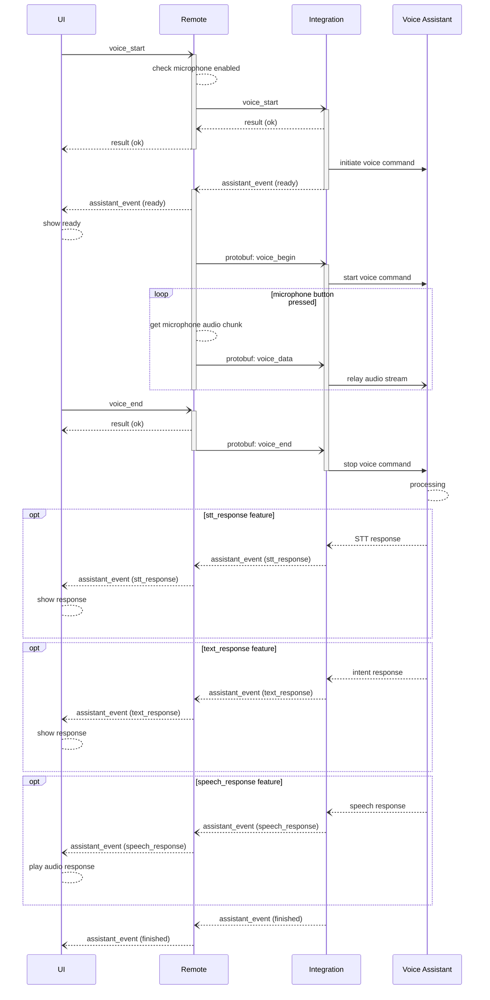

# Voice Assistant Entity

> [!NOTE]
> The [Home Assistant integration](https://github.com/unfoldedcircle/integration-home-assistant) is used as the first
> reference implementation, followed by Android TV.

A voice assistant entity interacts with a voice assistant or sends voice commands to voice-capable devices.
It can request an audio stream from the Remote's microphone when the user pushes the voice button.

This allows forwarding voice commands to the voice control feature of a device, or to a cloud-based voice assistant like
Amazon Alexa or Google Home.

Please note that an integration does not have direct access to the microphone and cannot initiate voice recording.
This is only possible by the user pressing the voice button.

## Features

The features describe the capabilities of the voice assistant.

Some devices only offer simple one-way voice command features, where the result of the command is shown or signaled on
the device itself, for example, with a speech response on a smart speaker.
The Android TV is such a device; a voice command can be sent, then the result is only shown or played on the TV.

Smart home systems can offer two-way voice command features, where the result(s) of the command is also returned to the
client.
Home Assistant offers such functionality with the assist pipeline. The individual processing steps like speech-to-text,
intent recognition and speech feedback are accessible.

| Name            | R  | W  | Description                                              |
|-----------------|----|----|----------------------------------------------------------|
| transcription   | ✅  | ❌  | Speech to text response of the transcribed voice command |
| response_text   | ✅  | ❌  | Textual response of the performed action                 |
| response_speech | ✅  | ❌  | Voice response of the performed action                   |

### Attributes

| Attribute | Features  | Type | Values            | Description                     |
|-----------|-----------|------|-------------------|---------------------------------|
| state     |           | enum | [States](#states) | Default entity state attribute. |

### States

The entity `state` attribute holds the following values:

| Value    | Description                                                |
|----------|------------------------------------------------------------|
| OFF      | The device is ready but the voice feature is not available |
| ON       | Ready for voice commands                                   |

Also includes the [common entity states](README.md#states).

### Device Classes

None.

### Options

| Name              | Type               | Default | Description                         |
|-------------------|--------------------|---------|-------------------------------------|
| audio_cfg         | AudioConfiguration | {}      | Audio stream format                 |
| profiles          | Profile            | []      | List of supported profiles          |
| preferred_profile | String             |         | Preferred profile to use as default |

#### Audio Configuration

The default audio stream the integration receives from the Remote is in PCM 16 kHz mono 16-bit signed format.
Audio chunks are sent every 100–200 ms.

The `audio_cfg` option can specify a different audio format to be sent to the integration.
If an unsupported audio stream is requested, the default setting is used. For example, if a sample rate of 4 kHz is
requested, the default sample rate of 16 kHz is used.

The `AudioConfiguration` object of the `audio_stream` option has the following properties:

| Property       | Type   | Default | Description                            |
|----------------|--------|---------|----------------------------------------|
| channels       | Number | 1       | Number of audio channels: 1 or 2       |
| sample_rate    | Number | 16000   | Sample rate of the audio stream in Hz. |
| sample_format  | enum   | I16     | Audio frame format.                    |

The actual audio stream format is included in the `voice_start` command and in the first
[`RemoteVoiceBegin` protobuf message](../../integration-api/ucr_integration_voice.proto) when the audio stream is
started. See the [Integration-API](https://unfoldedcircle.github.io/core-api/integration/) for the full definition.

#### Profiles

The `profiles` option allows specifying a list of voice assistant profiles that can be used by starting a voice command.
Profiles are optional and allow parameterizing voice input. A regular voice-capable device usually just accepts voice
input without additional parameters. Home automation systems can offer multi-language support or an option to use
local or cloud processing.

For example, Home Assistant allows configuring multiple Assist pipelines for voice commands. These pipelines can offer
different languages or speech recognition engines.

The `Profile` object has the following properties:

| Property        | Type   | Description                                                                                              |
|-----------------|--------|----------------------------------------------------------------------------------------------------------|
| id              | String | Profile identifier                                                                                       |
| name            | String | Friendly name to show in UI                                                                              |
| language        | String | Optional: language code for speech recognition if the profile represents a specific language             |
| transcription   | bool   | Optional: supports voice command transcription. Entity feature is used if not specified.                 |
| response_text   | bool   | Optional: Supports textual response about the performed action. Entity feature is used if not specified. |
| response_speech | bool   | Optional: Supports speech response about the performed action. Entity feature is used if not specified.  |

The profile identifier can be specified in the `profile_id` parameter of the `voice_start` command.

## Integration API

The following sequence diagram shows the happy message flow of a voice command initiated by the UI. It's a simplified
representation of the communication between the various components, showing the relevant Core-API and Integration-API
messages. The interaction between an integration driver and the voice assistant depends on the involved system and
available features. 



### Commands

The integration driver has to implement a handler for the `entity_command` WebSocket message to process the following
command requests in `msg_data.cmd_id`. See [Integration-API](https://unfoldedcircle.github.io/core-api/integration/)
for the full message structure.

| cmd_id      | Parameters      | Type               | Description                                                                    |
|-------------|-----------------|--------------------|--------------------------------------------------------------------------------|
| voice_start | session_id      | Number             | Audio session identifier that will be used in follow-up binary voice messages. |
|             | audio_cfg       | AudioConfiguration | Audio stream format used in WS binary messages.                                |
|             | speech_response | bool               | Optional: enable voice response of the performed action.                       |
|             | timeout         | Number             | Optional: processing timeout in seconds.                                       |
|             | profile_id      | String             | Optional: profile used for the voice assistant command.                        |

Notes:
- The Integration-API only defines the `voice_start` Websocket command.
- The end-of-stream notification is sent with the Protobuf message `RemoteVoiceEnd`.
- The Core-API defines `voice_start` and `voice_end` commands. 

#### voice_start

After confirming the `voice_start` command, the audio stream is started and transmitted as binary WebSocket messages
in protocol buffer format (see [protobuf messages](../../integration-api/ucr_integration_voice.proto)).

- The confirmation message must be sent within 2 seconds, or the user interface might abort the command.
- If the integration already knows that it can't process voice commands, it needs to send a negative response.
- The integration must send the `start` event with the provided `session_id`, when it is ready to receive the audio stream.
- The audio stream is stopped if an `error` event is sent by the integration.

Example:
```json
{
  "kind": "req",
  "id": 123,
  "msg": "entity_command",
  "msg_data": {
    "entity_type": "voice_assistant",
    "entity_id": "va-1",
    "cmd_id": "voice_start",
    "params": {
      "session_id": 8,
      "audio_cfg": {
        "channels": 1,
        "sample_rate": 8000,
        "sample_format": "I16"
      }
    }
  }
}
```

### Events

#### Entity change event

The regular `entity_change` event must be emitted by the integration driver if the state of the voice assistant changes.
For example, if a voice assistant becomes unavailable because a required cloud service is no longer responding.

The following attributes must be included:

| Attribute     | Description                   |
|---------------|-------------------------------|
| state         | New entity [state](#states).  |

Example:
```json
{
  "kind": "event",
  "msg": "entity_change",
  "cat": "ENTITY",
  "msg_data": {
    "entity_type": "voice_assistant",
    "entity_id": "va-1",
    "attributes": {
      "state": "ON"
    }
  }
}
```

#### Assistant event

The `assistant_event` must be emitted by the integration driver to start the audio stream and for providing optional
feedback about the voice command processing and outcome.

| Event           | Data      | Type   | Description                                                    |
|-----------------|-----------|--------|----------------------------------------------------------------|
| ready           |           |        | Integration is ready to receive voice audio stream.            |
| stt_response    | text      | string | Optional. Transcribed text from voice audio stream.            |
| text_response   | text      | string | Optional. Textual response about the performed action.         |
|                 | success   | bool   | Action result.                                                 |
| speech_response | url       | string | Optional. Speech response about the performed action.          |
|                 | mime_type | string |                                                                |
| finished        |           |        | Voice processing finished.                                     |
| error           | code      | string | Processing error while sending or processing the audio stream. |
|                 | message   | string |                                                                |

Supported audio mime types for the `speech_response` event:
- `audio/mpeg`
- `audio/mp3`
- `audio/wav`
- `audio/x-wav`
- `audio/ogg`
- `audio/opus`
- `audio/webm`
- `audio/flac`
- `audio/aac`

See the [Integration-API](https://unfoldedcircle.github.io/core-api/integration/) for the full event definitions.

#### Ready event

The `ready` event is emitted after the `voice_start` command has been confirmed.
The `session_id` is used to identify the audio stream.

```json
{
  "kind": "event",
  "msg": "assistant_event",
  "cat": "ENTITY",
  "msg_data": {
    "type": "ready",
    "entity_id": "va-1",
    "session_id": 8
  }
}
```

##### Speech to text event

```json
{
  "kind": "event",
  "msg": "assistant_event",
  "cat": "ENTITY",
  "msg_data": {
    "type": "stt_response",
    "entity_id": "va-1",
    "session_id": 8,
    "data": {
      "text": "Switch off the living room lights"
    }
  }
}
```


#### Text response event

```json
{
  "kind": "event",
  "msg": "assistant_event",
  "cat": "ENTITY",
  "msg_data": {
    "type": "text_response",
    "entity_id": "va-1",
    "session_id": 8,
    "data": {
      "success": true,
      "text": "Switched off living room lights"
    }
  }
}
```

#### Speech response event

```json
{
  "kind": "event",
  "msg": "assistant_event",
  "cat": "ENTITY",
  "msg_data": {
    "type": "speech_response",
    "entity_id": "va-1",
    "session_id": 8,
    "data": {
      "url": "https://smart.home/api/tts_proxy/6ZZGII-UgUfEEI8CbH1TNg.mp3",
      "media_type": "audio/mpeg"
    }
  }
}
```

##### Error event

```json
{
  "kind": "event",
  "msg": "assistant_event",
  "cat": "ENTITY",
  "msg_data": {
    "type": "error",
    "entity_id": "va-1",
    "session_id": 8,
    "data": {
      "code": "NO_TEXT_RECOGNIZED",
      "message": "I did not understand"
    }
  }
}
```

Defined error codes:
- NO_TEXT_RECOGNIZED
- SERVICE_UNAVAILABLE
- INVALID_AUDIO
- NO_TEXT_RECOGNIZED
- INTENT_FAILED
- TTS_FAILED
- TIMEOUT
- UNEXPECTED_ERROR
