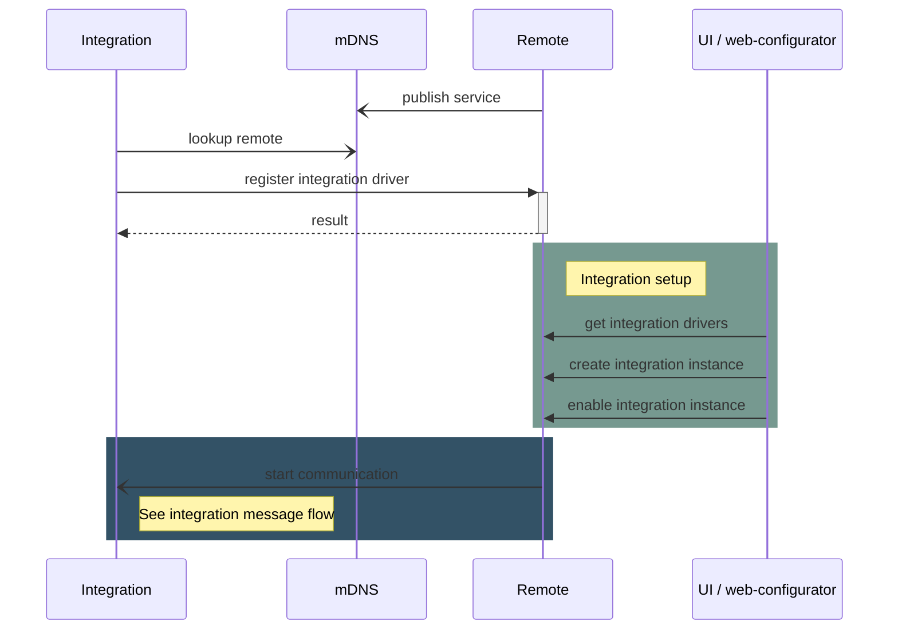

## Driver Registration

An integration driver can optionally register itself in a remote if the [driver advertisement](driver-advertisement.md)
for auto-discovery is not sufficient.  
This is a convenience feature if a driver would like to provide its access token without the user requiring to manually
enter it, or if the driver cannot be automatically be discovered by the remote due to network setup (non-local servers,
firewalls, VLAN etc.).

### Registration REST API

Driver registration is only possible through the Remote core REST API.

See: <https://github.com/unfoldedcircle/core-simulator/tree/main/core-api>
