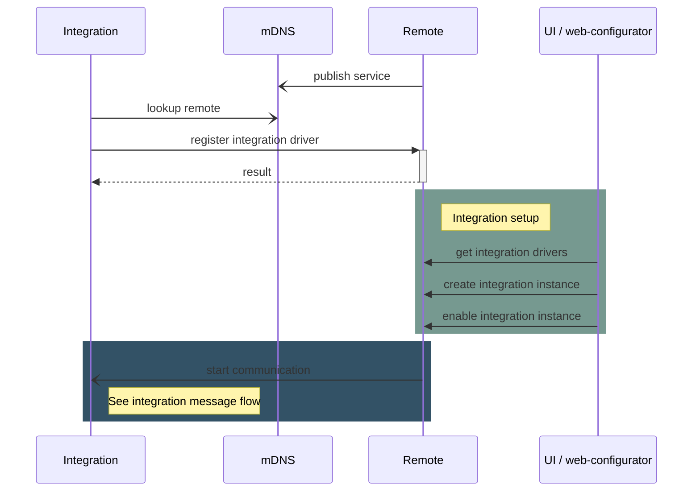
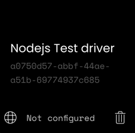
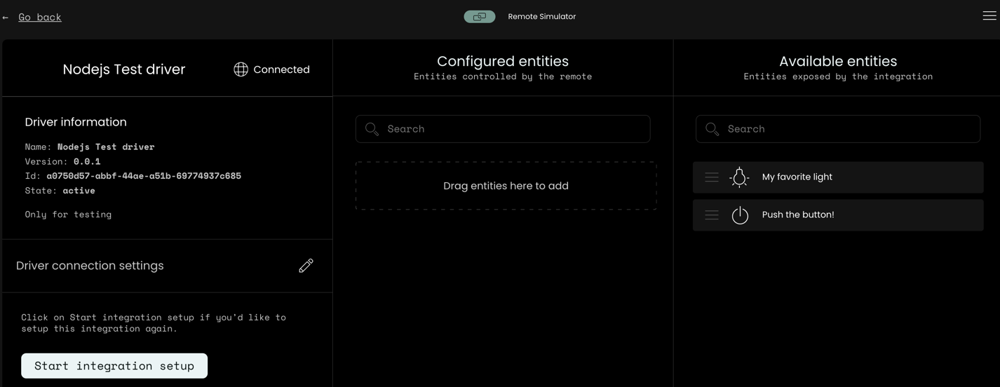

## Driver Registration

An external integration driver can optionally register itself in a remote if the [driver advertisement](driver-advertisement.md)
for auto-discovery is not sufficient.  
This is a convenience feature if a driver would like to provide its access token without the user requiring to manually
enter it, or if the driver cannot be automatically be discovered by the remote due to network setup (non-local servers,
firewalls, VLAN etc.).



### Registration REST API

Driver registration is only possible through the Remote core REST API.

See: <https://github.com/unfoldedcircle/core-api/tree/main/core-api>

#### Example

Register the [simulated-light driver](https://github.com/unfoldedcircle/integration-node-library/tree/main/examples/simulated-light)
using the [Core-Simulator Docker setup](https://github.com/unfoldedcircle/core-simulator/tree/main/docker).
This also works using the Simulator VM running with bridge networking:

- The integration driver is accessible at `192.168.1.115` and listens on port `9988`. Adapt to your environment!
- Register driver with `"driver_url:" "ws://192.168.1.115:9988"`
- Use the [predefined Postman collection](https://github.com/unfoldedcircle/core-api/tree/main/core-api/rest)
  to interact with the Simulator from the host, or use a curl call:

```bash
curl --location 'http://localhost:8080/api/intg/drivers' \
--user "web-configurator:1234" \
--header 'Content-Type: application/json' \
--data '
{
  "driver_id": "unique-driver-id or omit for auto generated uuid",
  "name": {
    "en": "Nodejs Test driver"
  },
  "driver_url": "ws://192.168.1.115:9988",
  "version": "0.0.1",
  "icon": "uc:test",
  "enabled": true,
  "description": {
    "en": "This is the way"
  },
  "device_discovery": false,
  "setup_data_schema": {},
  "release_date": "2023-04-02"
}
'
```
- Note: using localhost:8080 when running from the host where the Simulator service is running in a container.

After a successful registration the driver will show up in the web-configurator:



Click on the driver and start the setup:


The above example has an empty `setup_data_schema`, so there won't be a user interaction and the setup only consists
of connecting to the driver and fetching the driver information.


The driver is now registered and the available entities will show up in the driver configuration:


