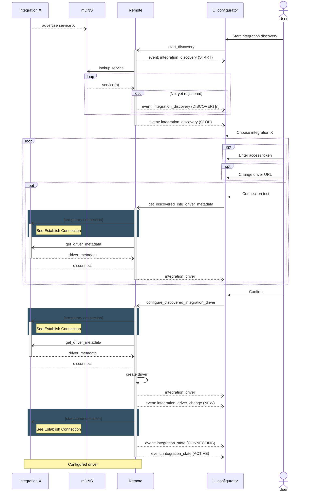
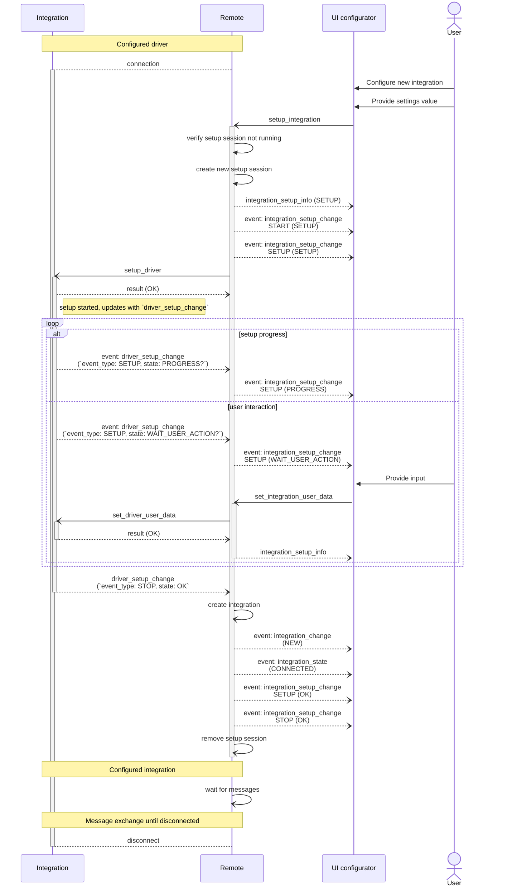

## Driver Setup

⚠️ **work in progress!**

An integration driver can support a settings page and an interactive setup flow with the Remote Two app or
web-configurator to configure the driver. 

The integration driver can specify a `setup_data_schema` for the initial setup screen for the user to fill out.
This can be as simple as an information text or a confirmation button without any further interactions. It also allows
to define more sophisticated user interactions where the integration driver sends dynamic setup screens to the user,
e.g. offer choices or asking for more input data.

### Driver Registration

The following sequence diagram shows the happy message flow of a driver registration.
Note that driver registration can be aborted at every stage with an error response or timeout.

### Driver Setup Flow

The following sequence diagram shows the message flow after the driver registration above.
Again, the happy flow is shown. An error response or timeout can occur at any step in the process.

