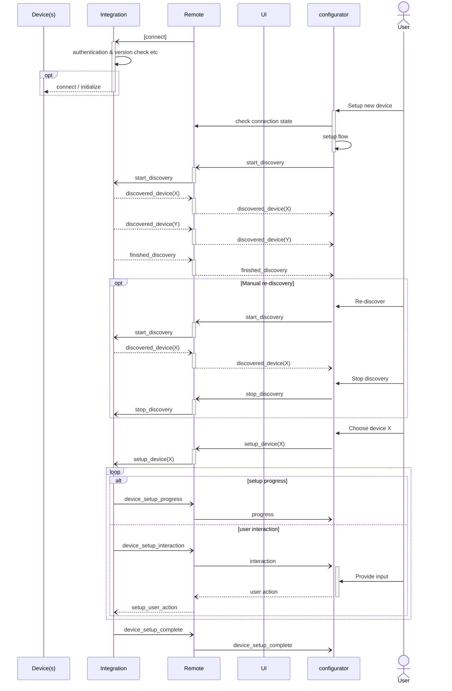

### Multi Device Instance Driver

**TODO review, not yet finalized!**

_TODO add introduction_

The multi device instance driver adds discovery and user interaction to the setup process.

- The `device_id` property must be used in all messages to identify the specific device.

