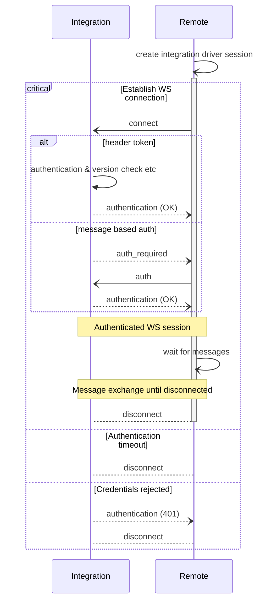
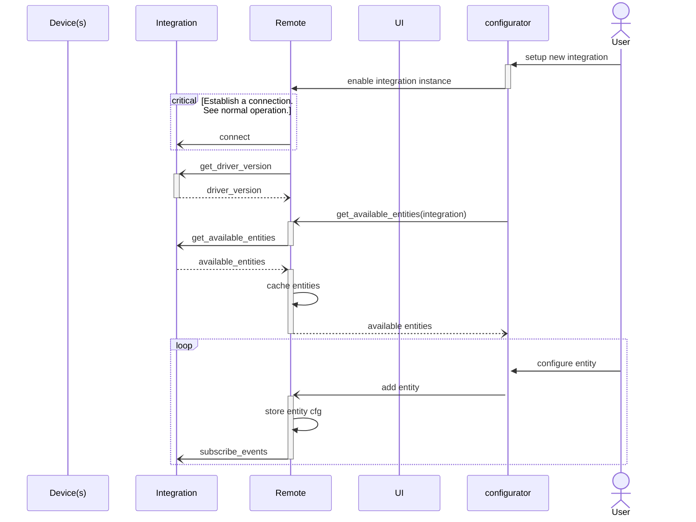
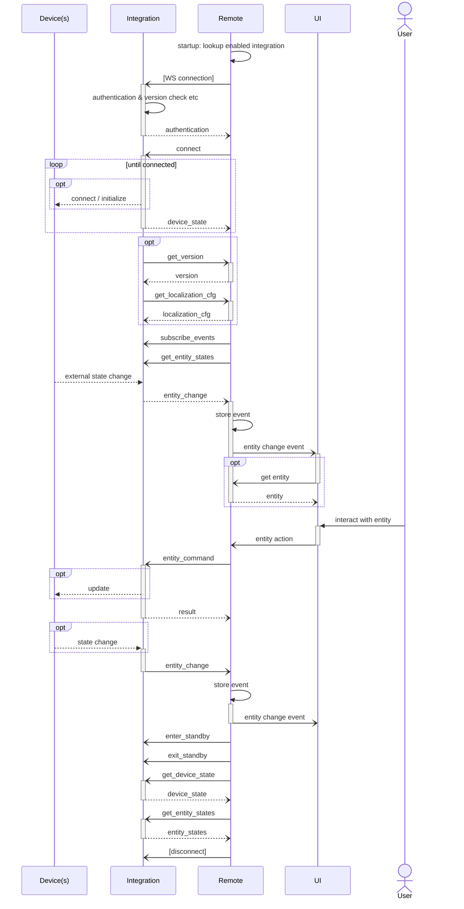

## How to write an integration driver

The integration API allows to develop external integration drivers in any programming language capable of running
a WebSockets server. Custom integration drivers require Node.js or a statically linked binary.

- `External integration driver`: a driver running on an external device, reachable by the Remote. 
- `Custom integration driver`: a driver running on the Remote in a restricted, sandboxed environment.

ℹ️ Beta release 1.9.0 allows to install custom integration drivers on the Remote.   
This is a developer preview feature to test integrations. See [Driver installation on the Remote](driver-installation.md)
for more information.

ℹ️ See [NodeJS API wrapper](https://github.com/unfoldedcircle/integration-node-library) for a quick start in JavaScript,
or the [Python API wrapper](https://github.com/unfoldedcircle/integration-python-library) if using Python.

When writing a driver from scratch without using a wrapper library:

1. Choose your programming language.
2. Choose a WebSockets server library or framework for your language.
3. Choose a JSON framework for your language.
4. Choose which [entities and features](../entities/README.md) the driver should expose.
5. Implement the required WebSockets text messages in the [WebSocket Integration API](../../integration-api/asyncapi.yaml).

❗️ Using a wrapper library or one of the existing open source drivers as a start will greatly simplify driver development.
Node.js should be preferred when developing a custom integration driver.

### Integration Driver Types

The API defines two different driver types: a simple single-device driver or a multi-device instance driver.

⚠️ Only the single device instance driver is supported. The multi-device driver type will most likely not be implemented
in the near future!

#### Single Device Instance Driver

The single-device instance driver is the default and easiest driver to develop:

- There is no concept of different or individual devices, just entities that the driver provides. 
- The driver offers a list of available entities to the remote. This can be a single media player entity, or a large
  list of different entities from a home automation hub.
- The optional `device_id` property must be omitted in all messages. 
- The driver may still control multiple physical devices, but from the Remote's point of view, these are just different
  entities provided from the same integration driver.

E.g. if smart WiFi light bulbs can be discovered by the driver and then each bulb can be provided as a
[light entity](../entities/entity_light.md) to the remote.

### Authentication

⚠️ Custom integrations running on the remote do not support authentication.

An external integration driver can choose if the Remote Two requires authentication or not to connect to the driver.  
Supported are header based token authentication during connection setup or with an application level message after the
connection has been established.

See [WebSocket authentication](websocket.md#authentication) for more information.

### Connection Handling

- Support multiple Remote sessions
  - An external driver should support multiple, independent WebSocket connections at the same time. 
- Keep alive
  - The driver must support WebSocket [Ping Pong control frames](https://tools.ietf.org/html/rfc6455#section-5.5.2).  
    Please check your WebSocket library, most libraries support this out of the box.
  - The Remote Two continuously sends ping frames and automatically closes the connection if it doesn't receive a pong
    within a certain time frame. The driver may also send ping frames to check if the connection is still alive.

### Driver Registration

⚠️ Custom integrations running on the remote are automatically registered during installation.

An external integration driver should advertise itself over mDNS for auto-discovery and allow user configuration with
the web-configurator. See [mDNS advertisement](driver-advertisement.md) for more information.

An external integration driver can optionally register itself at a remote and provide its authentication token.

See [driver registration](driver-registration.md) for more information.

### Discover Remote Two Devices

The Remote Two can be discovered with DNS-SD. It announces itself with service type `_uc-remote._tcp`.

See [remote DNS-SD lookup](../discovery.md) for more information.

### JSON Messages

#### Message Format

- Only WebSockets Text message are supported at the moment.  
  Binary support might be added in the future.
- All messages are serialized in JSON format.
- Text encoding is UTF-8.
- The application level protocol defines two message interactions with three different message types:
  - Request / response messages
  - Event messages

#### Request Messages

- A request message is of kind `req`.
- Every request message must include a unique `id` value, which must be increased for every new request.
- The request message type is specified in property `msg`.
- An optional `msg_data` object holds the request specific data.
- A request message is usually answered by a response message if not otherwise stated in the documentation.  
  Exceptions are event responses, e.g. if the event can be triggered independently of the request message.

Example of a request message:

```json
{
  "kind": "req",
  "id": 123,
  "msg": "entity_command",
  "msg_data": {
    "entity_type": "button",
    "entity_id": "button-1",
    "cmd_id": "push"
  }
}
```

#### Response Messages

- A response message is of kind `resp`.
- The corresponding `id` of the request message is given in property `req_id`.
- The response message type is specified in property `msg`.
- The status of the request operation is given in `code`.
- The `msg_data` object holds the response specific data.

Example of a response message:

```json
{
  "kind": "resp",
  "req_id": 11,
  "msg": "available_entities",
  "code": 200,
  "msg_data": {
    "available_entities": [
      {
        "entity_id": "button-1",
        "entity_type": "button",
        "name": {
          "en": "Ring dinner bell"
        }
      }
    ]
  }
}
```

#### Event Messages

- An event message is of kind `event`.
- The event type is specified in property `msg`.
- The optional `cat` property denotes the event category.
- The optional `ts` property holds the timestamp when the event occurred.
- The `msg_data` object holds the event specific data.

Example of an event message:

```json
{
  "kind": "event",
  "msg": "entity_change",
  "cat": "ENTITY",
  "ts": "2021-04-24T14:15:22Z",
  "msg_data": {
    "entity_type": "cover",
    "entity_id": "blind-1",
    "attributes": {
      "position": 72
    }
  }
}
```

### Required Messages

For a functioning integration driver not all defined messages and optional features in the integration API have to be
implemented. The mandatory messages are tagged with a pizza 🍕 emoji in the [WebSocket Integration AsyncAPI definition](../../integration-api/asyncapi.yaml).

Required request messages which must be processed and answered by a driver:

| Request                  | Response             | Description                                                                                                                |
|--------------------------|----------------------|----------------------------------------------------------------------------------------------------------------------------|
| `get_driver_version`     | `driver_version`     | Get version information about the integration driver.                                                                      |
| `get_device_state`       | `device_state`       | Get the current device state.<br/>This informs the Remote Two if the device is ready or not available.                     |
| `get_available_entities` | `available_entities` | Retrieve the available entities from the integration driver.                                                               |
| `subscribe_events`       | `result`             | Subscribe to entity state change events.<br/>This instructs the driver to send entity state changes for specific entities. |
| `get_entity_states`      | `entity_states`      | Get the current state of the entities.<br/>This provides the Remote Two the current entity properties.                     |
| `entity_command`         | `result`             | Instructs the driver to execute an entity command.<br/>This sets entity properties from user interactions.                 |

Required event messages which must be sent by the driver:

| Event            | Description                                     |
|------------------|-------------------------------------------------|
| `entity_change`  | Emitted when an attribute of an entity changes. |
| `device_state`   | Emitted when the device state changes.          |


### Common Message Flow

The basic message flow between an integration and the remote is as follows:

- The integration driver acts as server and the Remote Two initiates the connection.
- After the WebSocket connection is established to the integration driver, the remote subscribes to events of all
  configured entities.
- Whenever the state of the integration driver changes, the driver sends a device state event.  
  This is usually the device which the driver represents or connects / communicates with. E.g. a smart device, home
  automation hub, cloud service, etc.
- Whenever an entity attribute of a subscribed entity changes, the driver sends an entity state event.
- The remote announces when it goes into and out of standby, so the integration driver can act accordingly.   
  Note: the WebSocket connection might get disconnected during remote standby!

#### Establish Connection




#### Integration Driver Setup

See [driver setup](driver-setup.md).

#### Integration Instance Configuration

After the driver has been registered and configured, the provided entities can be configured in the Remote Two.

This consists of requesting all available entities from the driver and subscribing to entity events of the chosen
entities by the user.

- The `subscribe_events` message is only sent for entities which are configured in the Remote. I.e. only for entities
  which are used in a profile and placed on a page or group.
- For simplicity reasons the driver may choose to always send events for all entities. The Remote will ignore
  unnecessary events. However, it's recommended to limit the message exchange to entities which are actually used to
  save network & processing resources.
- The configured entities from the user(s) are stored in the remote-core application.  
  Whenever the Remote (re)connects to the driver, only those entity identifiers are submitted in the `subscribe_events`
  message.
- The driver can use the `get_version` message to retrieve version and model information of the Remote. 
- The driver can use the `get_localization_cfg` message to retrieve localization information from the remote if it deals
  with localized labels, values etc.



#### Normal Operation

During normal operation there are only a few different message exchanged between the Remote and the integration driver:

- `authentication`: sent by the driver after WebSocket connection is established
- `subscribe_events`: sent by the Remote after the WebSocket connection is authenticated
- `entity_command`: instruct the driver to perform an action on an entity
- `entity_change`: inform the Remote that an entity changed
- `get_device_state`: request the device state from the driver
- `get_entity_states`: request the current entity attributes and states


