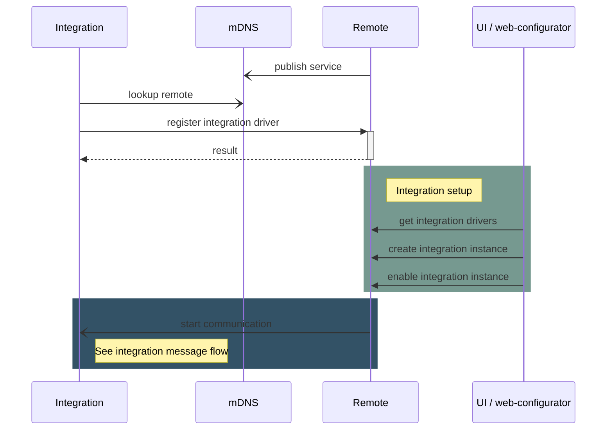
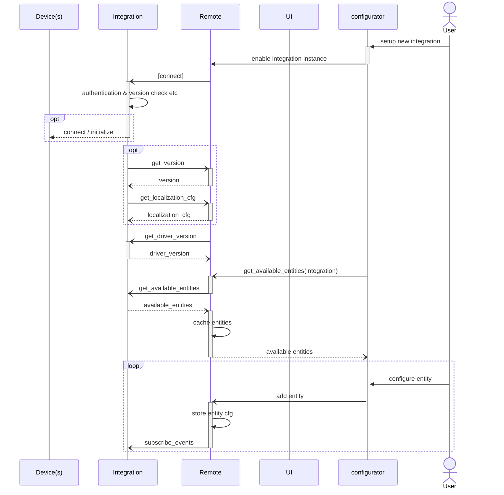
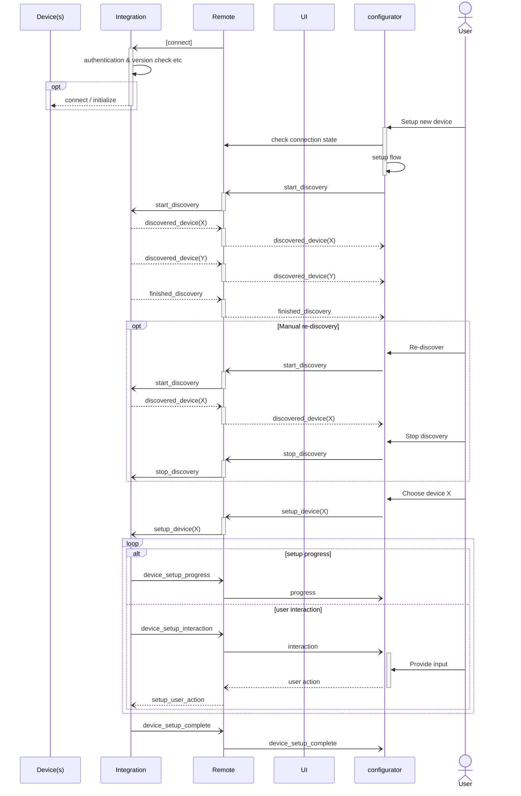
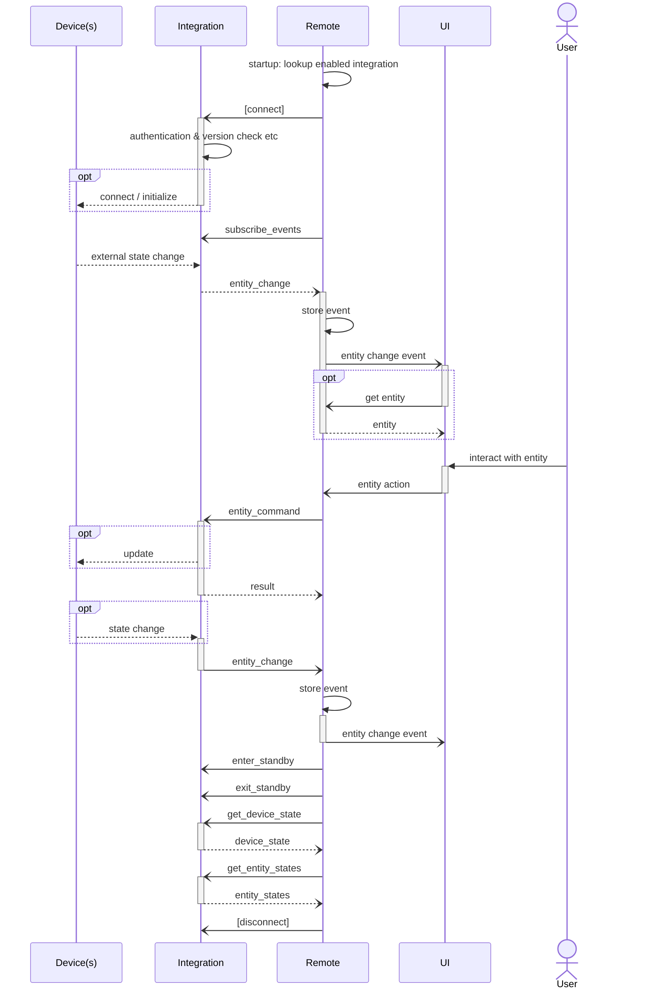

# WebSocket Integration API

- [AsyncAPI definition](asyncapi.yaml)
- [Remote Two entities](entities/README.md)
- [How to write an integration driver](write-integration-driver.md)
- [WebSockets handling](websocket.md)

## Driver Registration

An integration driver can optionally register itself in a remote. This is a convenience feature if a driver would like
to provide its access token without the user requiring to manually enter it, or if the driver cannot be automatically 
be discovered by the remote due to network setup (non-local servers, firewalls, VLAN etc.).



### Registration REST API

Driver registration is only possible through the Remote REST API.

See: _TODO link to OpenAPI definition_

Curl example:
```bash
curl ...
```

## Message Flow
The basic message flow between an integration and the remote is as follows:

- The integration driver acts as server and the remote initiates the connection.
- After the WebSocket connection is established to the integration driver, the remote subscribes to events of all
  configured entities.

### Integration Setup

- During setup of the UI and configuring a user profile the remote asks the integration about the available entities.
  - The user chosen entities are configured and stored in the remote.



### Multi Driver Instance Handling

**TODO review, not yet ready for implementation!**



### Common Message Flow

- Whenever the state or an entity attribute in the integration driver changes, the driver sends a state event.
- The remote announces when it goes into and out of standby, so the integration driver can act accordingly.   
  Note: the WebSocket connection might get disconnected during remote standby!


