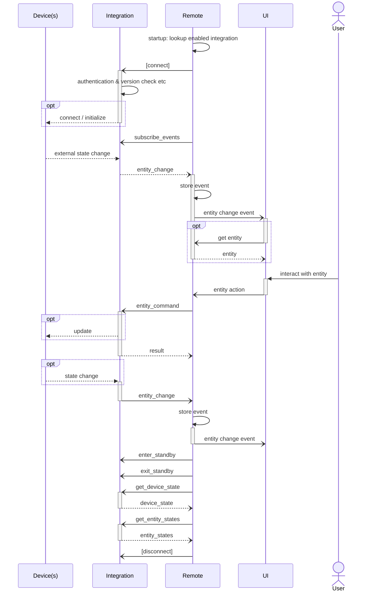

## How to write an integration driver

_TODO this is an initial draft only!_

The integration API allows to develop integration drivers in any programming language capable of running a WebSockets
server.

ℹ️ At the moment only external integrations which run on a separate device on your network are supported.

We will publish the requirements and supported runtimes at a later date. The only thing we can say right now is that
aiming for a statically compiled binary will have a higher chance of being compatible for on-device publishing.
This includes for example Rust and C / C++, whereas interpreted languages like Java, Python and Node.js etc. will most
likely not be suitable. Reasons are the limited resources (memory, storage, CPU) on an embedded device. A good
reference for testing is a [Raspberry Pi Zero W](https://www.raspberrypi.com/products/raspberry-pi-zero-w/), which
is also the platform of the former YIO Remote.

1. Choose your programming language.
2. Choose a WebSockets server library or framework for your language.
3. Choose a JSON framework for your language.
4. Implement the required WebSockets text messages in the [WebSocket Integration API](./asyncapi.yaml).
5. Choose which [entities and features](./entities/README.md) the driver should expose.

### Authentication

An integration driver can choose if the Remote Two requires authentication or not to connect to the driver.  
Supported are header based token authentication during connection setup or with an application level message after the
connection has been established.

See [WebSocket authentication](websocket.md#authentication) for more information.

### Connection Handling

- Support multiple Remote sessions
  - A driver should support multiple, independent WebSocket connections at the same time. 
- Keep alive
  - The driver must support WebSocket [Ping Pong control frames](https://tools.ietf.org/html/rfc6455#section-5.5.2).  
    Please check your WebSocket library, most libraries support this out of the box.
  - The Remote Two continuously sends ping frames and automatically closes the connection if it doesn't receive a pong
    within a certain time frame. The driver may also send ping frames to check if the connection is still alive.

### Driver Registration

An integration driver can optionally register itself at a remote and provide its authentication token.

See [driver registration](./driver-registration.md) for more information.

### Discover Remote Two Devices

The Remote Two can be discovered with DNS-SD. It announces itself with service type `_uc-remote._tcp`.

See [remote DNS-SD lookup](../doc/README.md#remote-dns-sd-lookup) for more information.

### JSON Messages

#### Message Format

- Only WebSockets Text message are supported at the moment.  
  Binary support might be added in the future.
- All messages are serialized in JSON format.
- Text encoding is UTF-8.
- The application level protocol defines two message interactions with three different message types:
  - Request / response messages
  - Event messages

#### Request Messages

- A request message is of kind `req`.
- Every request message must include a unique `id` value, which must be increased for every new request.
- The request message type is specified in property `msg`.
- An optional `msg_data` object holds the request specific data.
- A request message is usually answered by a response message if not otherwise stated in the documentation.  
  Exceptions are event responses, e.g. if the event can be triggered independently of the request message.

Example of a request message:

```json
{
  "kind": "req",
  "id": 123,
  "msg": "entity_command",
  "msg_data": {
    "entity_type": "button",
    "entity_id": "button-1",
    "cmd_id": "push"
  }
}
```

#### Response Messages

- A response message is of kind `resp`.
- The corresponding `id` of the request message is given in property `req_id`.
- The response message type is specified in property `msg`.
- The status of the request operation is given in `code`.
- The `msg_data` object holds the response specific data.

Example of a response message:

```json
{
  "kind": "resp",
  "req_id": 11,
  "msg": "available_entities",
  "code": 200,
  "msg_data": {
    "available_entities": [
      {
        "entity_id": "button-1",
        "entity_type": "button",
        "name": {
          "en": "Ring dinner bell"
        }
      }
    ]
  }
}
```

#### Event Messages

- An event message is of kind `event`.
- The event type is specified in property `msg`.
- The optional `cat` property denotes the event category.
- The optional `ts` property holds the timestamp when the event occurred.
- The `msg_data` object holds the event specific data.

Example of an event message:

```json
{
  "kind": "event",
  "msg": "entity_change",
  "cat": "ENTITY",
  "ts": "2021-04-24T14:15:22Z",
  "msg_data": {
    "entity_type": "cover",
    "entity_id": "blind-1",
    "attributes": {
      "position": 72
    }
  }
}
```

### Required Messages

For a functioning integration driver not all defined messages and optional features in the integration API have to be
implemented. The mandatory messages are tagged with a pizza 🍕 emoji in the [WebSocket Integration AsyncAPI definition](./asyncapi.yaml).

Required request messages which must be processed and answered by a driver:

| Request                  | Response             | Description                                                                                                                |
|--------------------------|----------------------|----------------------------------------------------------------------------------------------------------------------------|
| `get_driver_version`     | `driver_version`     | Get version information about the integration driver.                                                                      |
| `get_device_state`       | `device_state`       | Get the current device state.<br/>This informs the Remote Two if the device is ready or not available.                     |
| `get_available_entities` | `available_entities` | Retrieve the available entities from the integration driver.                                                               |
| `subscribe_events`       | `result`             | Subscribe to entity state change events.<br/>This instructs the driver to send entity state changes for specific entities. |
| `get_entity_states`      | `entity_states`      | Get the current state of the entities.<br/>This provides the Remote Two the current entity properties.                     |
| `entity_command`         | `result`             | Instructs the driver to execute an entity command.<br/>This sets entity properties from user interactions.                 |

Required event messages which must be sent by the driver:

| Event            | Description                                     |
|------------------|-------------------------------------------------|
| `entity_change`  | Emitted when an attribute of an entity changes. |
| `device_state`   | Emitted when the device state changes.          |


### Common Message Flow

- Whenever the state or an entity attribute in the integration driver changes, the driver sends a state event.
- The remote announces when it goes into and out of standby, so the integration driver can act accordingly.   
  Note: the WebSocket connection might get disconnected during remote standby!


